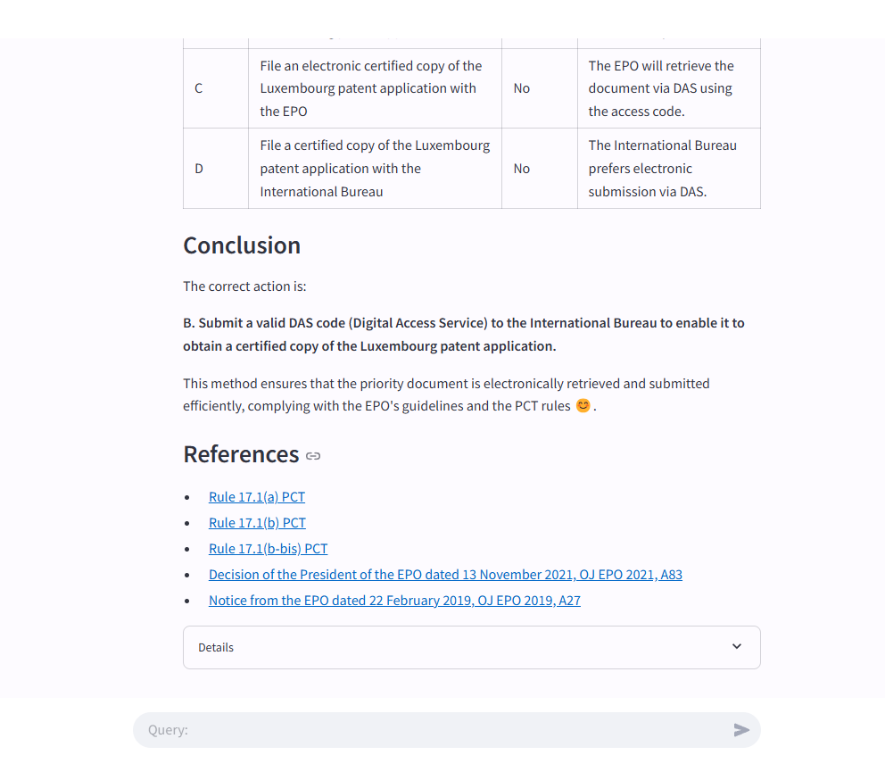

# Challenge AI - Plateforme d'Apprentissage pour les Ingénieurs Brevet

## Description
Challenge AI est une plateforme d'apprentissage destinée aux étudiants en ingénierie brevet. Elle exploite un modèle d'IA, **Mistral Large**, appelé via API et basé sur une approche **RAG (Retrieval-Augmented Generation)** combinée à du **scraping** des textes légaux de l'**EPO (Office Européen des Brevets)**.



## Fonctionnalités
- **Accès à des informations juridiques brevet** via scraping et analyse de textes.
- **Utilisation du modèle Mistral Large** pour générer des réponses précises et contextuelles.
- **Approche RAG** pour améliorer la pertinence des réponses.
- **API REST** permettant d'interagir avec le modèle et la base de connaissances.
- **Interface utilisateur Streamlit** pour une expérience interactive.

## Prérequis
Avant d'exécuter le projet, assurez-vous d'avoir installé les dépendances suivantes :
- **Python 3.9+**

Installez les dépendances avec la commande suivante :
```bash
pip install -r requirements.txt
```

Lancer le Projet
Démarrer le Serveur API
Accédez au dossier data_battle/api et exécutez la commande suivante :
```bash
cd data_battle/api
uvicorn main:app --reload
```
L'API sera accessible à l'adresse : http://127.0.0.1:8000

Démarrer l'Interface Utilisateur (Streamlit)
Accédez au dossier streamlit et exécutez :
```bash
cd streamlit
streamlit run Inscription-connection.py

